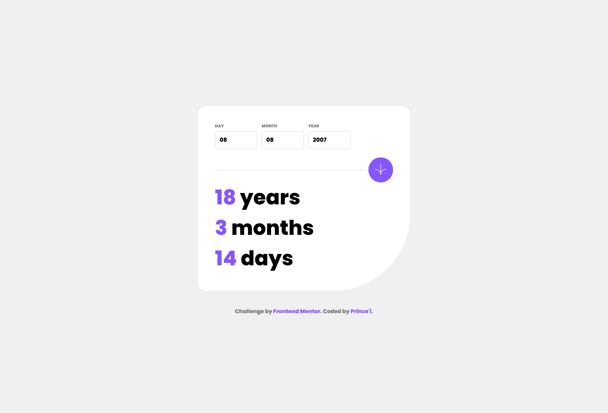

# Frontend Mentor - Age calculator app solution

This is a solution to the [Age calculator app challenge on Frontend Mentor](https://www.frontendmentor.io/challenges/age-calculator-app-dF9DFFpj-Q). Frontend Mentor challenges help you improve your coding skills by building realistic projects.

## Table of contents

- [Overview](#overview)
  - [The challenge](#the-challenge)
  - [Screenshot](#screenshot)
  - [Links](#links)
- [My process](#my-process)
  - [Built with](#built-with)
  - [What I learned](#what-i-learned)
  - [Continued development](#continued-development)
  - [Useful resources](#useful-resources)
  - [AI Collaboration](#ai-collaboration)
- [Author](#author)

## Overview

### The challenge

Users should be able to:

- View an age in years, months, and days after submitting a valid date through the form
- Receive validation errors if:
  - Any field is empty when the form is submitted
  - The day number is not between 1-31
  - The month number is not between 1-12
  - The year is in the future
  - The date is invalid e.g. 31/04/1991 (there are 30 days in April)
- View the optimal layout for the interface depending on their device's screen size
- See hover and focus states for all interactive elements on the page
- **Bonus**: See the age numbers animate to their final number when the form is submitted

### Screenshot



*(Don't forget to take a screenshot of your final app, name it `screenshot.png` and put it at the root of your project.)*

### Links

- Solution URL: [Add solution URL here](https://your-solution-url.com)
- Live Site URL: [Add live site URL here](https://your-live-site-url.com)

## My process

### Built with

- Semantic HTML5 markup
- CSS custom properties (variables)
- Flexbox
- Mobile-first workflow
- Vanilla JavaScript (DOM manipulation and constraints validation)

### What I learned

While working on this project, I significantly improved my **JavaScript** skills. I learned how to manipulate dates, handle complex form validations, and implement asynchronous UI animations (number counter).

One of the biggest challenges (and the best lesson) was validating impossible dates like "April 31st". The native JavaScript `Date` object tends to "fix" these errors by rolling over to the next month automatically (May 1st). 

Here is how I tackled the challenge of implementing smooth animations for the results:

```js
function animateNumber(element, target) {
    let current = 0;
    // Set a speed so the animation doesn't take too long (e.g., 20ms)
    const interval = setInterval(() => {
        if (current >= target) {
            element.textContent = target;
            clearInterval(interval);
        } else {
            current++;
            element.textContent = current;
        }
    }, 20);
}
```

I also managed the error messages cleanly and updated the UI dynamically using CSS:

```css
.error span {
  color: var(--primary-red);
  font-size: 0.6em;
}

.error span::before {
  content: "⚠ ";
}
```

### Continued development

In my future projects, I want to focus more on complex JavaScript animations and best practices for structuring CSS code in larger applications, such as using the BEM methodology.

### Useful resources

- [MDN Web Docs - Date](https://developer.mozilla.org/en-US/docs/Web/JavaScript/Reference/Global_Objects/Date) - Essential for understanding how the JavaScript Date object works, especially for dealing with leap years and the number of days per month.

### AI Collaboration

During this project, I paired with an AI coding mentor. It was extremely helpful for:
- Understanding why my CSS colors and pseudo-elements weren't applying initially (learning CSS Variables and Specificity).
- Explaining the JavaScript Date "1900 trap" (where two-digit years like '24' are treated as '1924') and helping me debug my logic.
- Understanding Git commands, such as how to undo a commit safely (`git reset`).

## Author

- GitHub - [Prince'i](https://github.com/hacp0102)
- Frontend Mentor - [@hacp0102](https://www.frontendmentor.io/profile/hacp0102)
